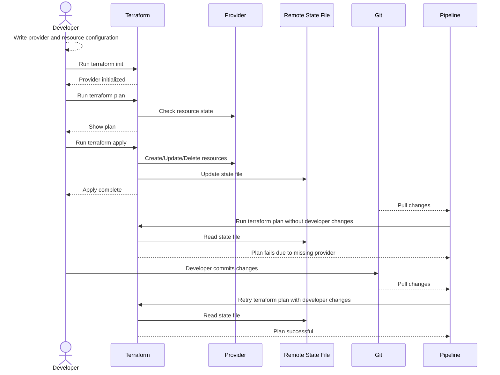

# README

Demonstrate some basic practices for Terraform  

## Checklist

Check for reordering behaviour with lists before committing.

## Versions

Installing different versions of Terraform

```sh
# list all remote versions
tfenv list-remote

# install a specific versions
tfenv install 0.11.15
tfenv use 0.11.15
```

## Linting

```sh
# format the code
terraform fmt -recursive  
# validate the module
terraform validate ./modules/redis 
```

## Generate documentation

```sh
# install terraform docs
brew install terraform-docs

# create the docs
terraform-docs markdown ./modules/redis > ./modules/redis/README.md
```

## Guards on variables

In version 13.x of Terraform we can put guards/validations on variables.  

```hcl
variable image {
  type    = string
  default = "redis:6.2.4-alpine"

  validation {
    condition     = substr(var.image, 0, 5) == "redis"
    error_message = "Image must be redis."
  }
}
```

## Modules to have guards

As demonstrated in [redis.tf](../08_module/modules/redis/redis.tf) we should put requirements on the modules.  

```hcl
terraform {
  required_version = "=0.13.7"

  required_providers {
    docker = {
      source  = "kreuzwerker/docker"
      version = "2.12.1"
    }
  }
}
```

## Adding providers

When adding resources that use providers in Terraform you need to make sure that any of the executions using that state have the provider defined.  This becomes important if you are manaually applying outside of a committed branch that a pipeline is using.  If the pipeline code sees reference to a provider in the state file it will fail that is not in the provider block it will fail.  



## Resources

* sequenceDiagram docs [here](https://mermaid.js.org/syntax/sequenceDiagram.html)
* mermaid online editor [here](https://mermaid.live/)
