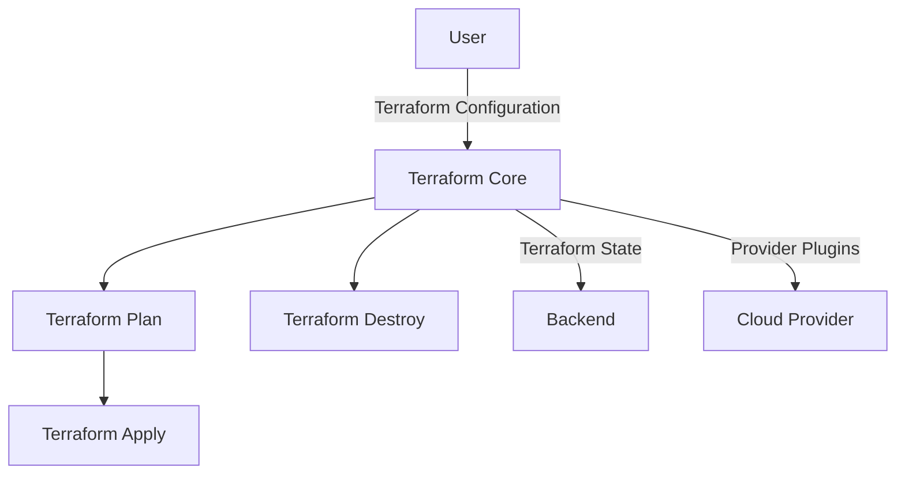

# README

[](https://skillicons.dev)

A repo for Terraform examples  
[Terraform Docs](https://www.terraform.io/)  

A list of things still to try and investigate [TODO.md](./TODO.md)  

## Terraform

Terraform is an open-source infrastructure-as-code (IAC) tool developed by HashiCorp. It enables users to define, provision, and manage cloud infrastructure using declarative configuration files. Terraform supports multiple cloud providers and offers a consistent, versioned approach to infrastructure management. Key features include modularity, collaboration, and extensibility, streamlining infrastructure deployment and minimizing manual errors.  



---

## Prereqs

```sh
# handling versions of terraform
brew install tfenv

# useful for processing outputs
brew install jq

# docs is useful for generating documentation and checking  descriptions have been added
brew install terraform-docs

# not really required so much after recent version improvements  
brew install terraform_landscape 
```


## 00 - Basic Practices

Demonstrate some basic practices for Terraform  
[README.md](00_basic_practices/README.md)  

## 01 - S3 bucket

Example of creating an S3 Bucket  
[README.md](01_s3_bucket/README.md)  

## 02 - asg

Example of creating an Auto Scaling Group  
[README.md](02_asg/README.md)  

## 03 - locks and versions

Demonstrate how to use locks and versions.  
[README.md](03_locks_versions/README.md)  

## 04 - envvars

Demonstrate how to use different environment variables.  
[README.md](04_envvars/README.md)  

## 05 - debugging

Demonstrate how to troubleshoot problems with Terraform  
[README.md](05_debugging/README.md)  

## 06 - processing plan files

Example of processing plan files for CI/CD pipelines  
[README.md](06_processing_plan_files/README.md)  

## 07 - remote_state

Example of using remote state  
[README.md](07_remote_state/README.md)  

## 08 - modules

Demonstrates a very basic module in Terraform.  
[README.md](08_module/README.md)  

## 09 - targeting resources  

Demonstrate how to control plan and apply using targets  
[README.md](09_targeting_resources/README.md)  

## 10 - workspaces

Demonstrate how to use workspaces  
[README.md](10_workspaces/README.md)  

## 11 - importing state

Demonstrate how to import existing resources into state  
[README.md](11_importing_state/README.md)  

## 12 - upgrading providers

Demonstrate how to upgrade terraform providers to newer versions  
[README.md](12_upgrading_providers/README.md)  

## 12 - upgrading between versions

Demonstrate how to upgrade terraform state to latest version  
[README.md](12_upgrading_terraform/README.md)  

## 13 - importing data (json + local_file)

Demonstrate how to import data from different places  
[README.md](13_importing_data/README.md)  

## 15 - importing data (json + webservice)

Demonstrate how to import data from a webservice  
[README.md](15_importing_webservice/README.md)  

## 19 - SOPS

Demonstrate how to use SOPS to keep data encrypted  
[README.md](19_sops/README.md)  

## 20 - CDK

Demonstrate how to use the CDK for Terraform.  
[README.md](20_cdk/README.md)  

## 21 - Importing SSM

Demonstrate how to import data from ssm to data drive terraform.  
[README.md](21_importing_ssm/README.md)  

## 22 - drift detection

Demonstrate some examples of how to use the `terraform refresh` to detect drift  
[README.md](22_drift_detection/README.md)  

## 23 - honeycomb

Demonstrate how to use the honeycomb provider.  
[README.md](23_honeycomb/README.md)  

## 24 - quine

A bit of fun to create a quine in Terraform.  
[README.md](24_quine/README.md)  

## 25 - moved block

Demonstrates how to use moved block.  
[README.md](25_moved/README.md)  

## 26 - github based modules

Demonstrates using a module in a subdirectory from a commitid  
[README.md](26_github_modules/README.md)  

## Resources

* Github [hashicorp/terraform](https://github.com/hashicorp/terraform)  
  * Release notes [tags](https://github.com/hashicorp/terraform/tags)  
* Examples [terraform-tuesdays](https://github.com/ned1313/terraform-tuesdays)  
* Examples [antonbabenko repos](https://github.com/antonbabenko?tab=repositories)  
* [awesome-terraform](https://github.com/antonbabenko/awesome-terraform)  
* Offical [tutorials/terraform](https://learn.hashicorp.com/tutorials/terraform)  

## Providers

* [terraform-provider-aws](https://github.com/hashicorp/terraform-provider-aws)  
